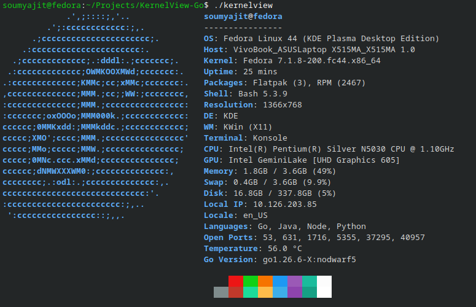
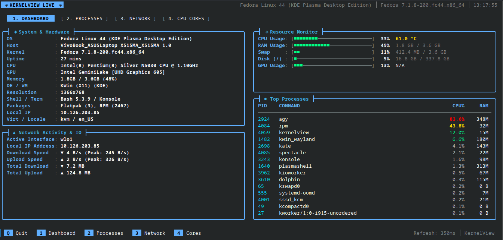
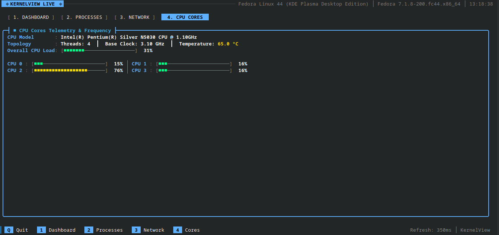

# 🚀 KernelView Go

<p align="center">
  <a href="https://kernelview.codedbysoumyajit.dev">
    
  </a>
  
  
  
  <a href="https://goreportcard.com/report/github.com/codedbysoumyajit/KernelView-Go">
    
  </a>
  <a href="https://github.com/codedbysoumyajit/KernelView-Go/releases">
    
  </a>
  <a href="https://github.com/codedbysoumyajit/KernelView-Go/actions/workflows/release.yml">
    
  </a>
</p>

**KernelView Go** is an ultra-fast, aesthetic system information fetcher and real-time terminal telemetry dashboard written in pure Go. Engineered for maximum efficiency, sub-millisecond data gathering, and zero runtime dependencies, it delivers instant hardware telemetry, distro-branded ASCII aesthetics, and an interactive multi-tab live TUI dashboard.

🌐 **Official Website & Docs**: [https://kernelview.codedbysoumyajit.dev](https://kernelview.codedbysoumyajit.dev)

---

## 📸 Visual Showcase

<p align="center">
  <b>System Fetch with Distro-Branded ASCII Art & Hardware Specs</b><br>
  
</p>

<p align="center">
  <b>Interactive Real-Time TUI Dashboard (Multi-Tab Telemetry)</b><br>
  
</p>

<p align="center">
  <b>Multi-Core CPU Frequency & Utilization Grid</b><br>
  
</p>

---

## ✨ Key Features

### 🎨 1. Distro-Branded CLI Fetch
* **Authentic ASCII Art**: Crisp, authentic terminal ASCII art for 40+ Linux distributions, macOS, Windows, and BSD variants matching Fastfetch.
* **Intelligent Theme Matching**: Automatically identifies the host operating system or distribution and styles titles, labels, keys, borders, and dividers in matching palette accents.
* **Side-by-Side Responsive Layout**: Renders ASCII art alongside system telemetry, with seamless auto-wrapping and vertical stacking on narrow terminals.
* **Terminal Color Grid**: Includes classic 16-color ANSI color blocks (`███`) for palette verification.

### 🖥️ 2. Real-Time TUI Dashboard (`-l`, `--live`)
* **Flicker-Free Terminal Rendering**: In-place cursor repositioning (`\033[H`) provides butter-smooth, flicker-free live dashboard updates.
* **Curved Themed Containers**: Clean rounded box drawing (`╭─`, `╮`, `│`, `╰`, `╯`) customized with OS color accents.
* **Interactive Multi-Tab Views**:
  * `[1] Dashboard`: Comprehensive overview (OS specs, CPU/RAM usage bars, active disk mounts, and top processes).
  * `[2] Processes`: Interactive, real-time process list sorted dynamically by CPU and memory consumption.
  * `[3] Network`: Live per-interface network throughput, transfer metrics, and bandwidth meters.
  * `[4] CPU Cores`: Dedicated per-core frequency and utilization telemetry in a responsive multi-column grid.

### 🎮 3. GPU & Graphics API Telemetry (`-g`, `--gpu`)
* **Dual-Architecture Support**: Concurrently detects integrated graphics (Intel Iris/UHD, AMD Radeon) and dedicated GPUs (NVIDIA, AMD, Apple Silicon).
* **Deep Hardware Metrics**: Gathers VRAM utilization, GPU core temperature, graphics driver versions, and compute API versions (OpenGL, Vulkan, OpenCL, CUDA, Metal).
* **Intel iGPU Frequency Tracking**: Direct sysfs frequency probing calculates real-time workload ratios and clock states.

### ⚡ 4. High-Performance Architecture
* **Pure Go Zero-Subprocess Probing**: Direct parsing of kernel interfaces (`/proc/meminfo`, `/proc/net/tcp`, `/proc/cpuinfo`, sysfs, DRM, macOS `SystemVersion.plist`, and Windows Registry).
* **Instant Package Resolution**: Internal pure Go SQLite B-Tree engine counts RPM database entries in `<0.3ms` without spawning external package manager binaries.
* **Smart Tiered Caching**: Real-time TUI metrics update at 350ms while heavier background probes are smoothly throttled to maintain `<1%` CPU utilization.
* **Robust Concurrency & Security**: Bound timeouts on all subsystem commands, thread-safe event loop channel updates, and secure HTTPS lookups.

---

## 🗂️ Supported Systems & Environments

| Linux Distributions | Apple macOS | Microsoft Windows | BSD Systems |
| :--- | :--- | :--- | :--- |
| **Fedora, Arch Linux, Ubuntu, Debian, Manjaro, Pop!_OS, NixOS, Void Linux, Kali Linux, Zorin OS, MX Linux, KDE neon, elementary OS, EndeavourOS, Garuda Linux, CachyOS, Bazzite, SteamOS, Parrot OS, Deepin, Tails, Qubes OS, Rocky Linux, AlmaLinux, Oracle Linux, Solus, Puppy Linux, Peppermint OS, antiX, Nobara Linux, Clear Linux, PCLinuxOS, Alpine, Gentoo, openSUSE, RHEL, CentOS, Linux Mint** | **macOS** (Apple Silicon M1/M2/M3/M4 & Intel AMD64) | **Windows 11 & 10** (Windows Terminal, PowerShell, CMD) | **FreeBSD, OpenBSD, NetBSD** |

---

## ⌨️ CLI Usage & Flags

```
╭────────────────────────────────────────────────────────╮
│   KernelView Go - System Fetch & Live Dashboard        │
│   Version: v1.3.1                                      │
╰────────────────────────────────────────────────────────╯

USAGE:
  kernelview [flags]

DISPLAY MODES:
  -l, --live         Start real-time TUI dashboard (interactive, multi-tab)
  -p, --process      Display static list of running processes
  -n, --network      Display detailed static network interfaces & stats
  -g, --gpu          Display detailed static GPU & graphics API report
  [default]          Display system fetch (distro ASCII logo & system specs)

CONFIGURATION OPTIONS:
  -f, --fast         Run system fetch in fast mode (skips network/ping checks)
  --json             Output gathered information as structured JSON
  --no-color         Disable all ANSI color formatting

INFO FLAGS:
  -v, --version      Print version and build information
  -h, --help         Print help menu

TUI INTERACTIVE KEYS:
  [1] Dashboard Tab   [2] Processes Tab   [3] Network Tab   [4] CPU Cores Tab   [Q] Quit
```

### Example Commands
```bash
# Standard system fetch
kernelview

# Fast mode (instant execution)
kernelview -f

# Launch real-time TUI dashboard
kernelview -l

# Detailed GPU telemetry report
kernelview -g

# Detailed network interfaces & ping
kernelview -n

# Output complete system specs as structured JSON
kernelview --json
```

---

## 🏎️ Performance Benchmarks

All benchmarks are measured as real wall-clock execution time on a standard multi-core workstation:

| Command / Mode | Typical Latency | Subsystem Details |
| :--- | :--- | :--- |
| **`kernelview -f` (Fast Mode)** | **`~45ms`** | Complete system hardware, CPU, memory, OS, shell, and display resolution |
| **`kernelview` (Default Mode)** | **`~100ms`** | Full fetch including packages (RPM/APT/Flatpak/Snap), open ports, languages, and temperature |
| **`kernelview -g` (GPU Mode)** | **`~80ms`** | GPU models, driver versions, VRAM capacity, OpenGL/Vulkan/CUDA API versions |
| **`kernelview -p` (Process Mode)** | **`~95ms`** | Ranked process table with PID, memory percentage, and user ownership |
| **`kernelview -l` (Live TUI)** | **`350ms Tick`** | Real-time interactive dashboard with `<1.0%` CPU utilization |

---

## 💻 Installation

### ⚡ One-Command Installers

#### Linux, macOS & BSD (sh / bash / zsh)
```bash
curl -fsSL https://raw.githubusercontent.com/codedbysoumyajit/KernelView-Go/main/install.sh | sh
```

#### Windows (PowerShell)
```powershell
irm https://raw.githubusercontent.com/codedbysoumyajit/KernelView-Go/main/install.ps1 | iex
```

---

### 📦 Pre-Built Binaries
Download pre-compiled release archives directly from the [GitHub Releases](https://github.com/codedbysoumyajit/KernelView-Go/releases) page:
* `kernelview_1.3.1_linux_amd64.tar.gz`
* `kernelview_1.3.1_linux_arm64.tar.gz`
* `kernelview_1.3.1_darwin_arm64.tar.gz` (Apple Silicon M-series)
* `kernelview_1.3.1_darwin_amd64.tar.gz` (Intel Mac)
* `kernelview_1.3.1_windows_amd64.zip`
* `kernelview_1.3.1_windows_arm64.zip`
* `kernelview_1.3.1_freebsd_amd64.tar.gz`
* `kernelview_1.3.1_openbsd_amd64.tar.gz`
* `kernelview_1.3.1_netbsd_amd64.tar.gz`

---

### 🛠️ Building From Source

1. Ensure **Go 1.21+** is installed:
   ```bash
   go version
   ```
2. Clone the repository and compile:
   ```bash
   git clone https://github.com/codedbysoumyajit/KernelView-Go.git
   cd KernelView-Go
   go build -ldflags="-s -w" -o kernelview .
   ```
3. Install to system path:
   ```bash
   sudo mv kernelview /usr/local/bin/  # Linux / macOS / BSD
   ```

---

## 📄 License

This project is open-source software licensed under the **MIT License**. See the [LICENSE](file:///home/soumyajit/Projects/KernelView-Go/LICENSE) file for details.
